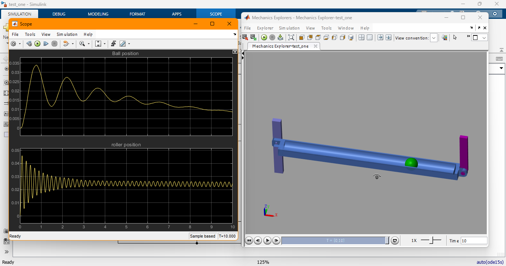

# Ball Balancing using PID Controller in MATLAB Simscape

## Table of Contents
- [Overview](#overview)
- [Features](#features)
- [Getting Started](#getting-started)
  - [Prerequisites](#prerequisites)
  - [Installation](#installation)
  - [Running the Simulation](#running-the-simulation)
- [Usage](#usage)
- [Contributing](#contributing)
- [License](#license)
- [Contact](#contact)

## Overview

This project demonstrates the implementation of a PID controller in MATLAB Simscape to balance a ball at a specified distance on a straight horizontal roller. The system consists of a ball rolling on a horizontal roller, with the goal of maintaining the ball's position at a desired setpoint.

<p align="center">
  
</p>

<p align="center"><em>Figure 1: Demonstration of the final model of the system on simscape matlab.</em></p>

## Features

- **Simscape Model**: Detailed Simscape model of the ball and roller system.
- **PID Controller**: Implementation of a PID controller to achieve stable balance.
- **Visualization**: Real-time simulation and visualization of the ball's position and control actions.
- **Parameter Tuning**: Adjustable PID parameters for optimal performance.

## Getting Started

### Prerequisites

- MATLAB R2021b or later
- Simulink
- Simscape

### Installation

1. Clone the repository:
   `git clone https://github.com/yourusername/ball-balancing-pid.git`
   ` cd ball-balancing-pid `

# Ball Balancing Model

## Getting Started

### Opening MATLAB and Simulink
1. Open MATLAB and navigate to the project directory.
2. Open the Simulink model by running the following command:
   ```matlab
   open_system('ball_balancing_model.slx')
   ```

### Running the Simulation
1. In the Simulink model, set the desired setpoint (target distance) for the ball.
2. Run the simulation by clicking the **Run** button in Simulink.
3. Observe the real-time visualization of the ball's position and the control actions of the PID controller.

## Usage

### Tuning PID Parameters
Adjust the **Kp**, **Ki**, and **Kd** parameters in the PID controller block to achieve the desired performance.

### Customizing the Model
Modify the Simscape components to explore different configurations and behaviors of the ball and roller system.

## Contributing
Contributions are welcome! Feel free to open issues or submit pull requests to enhance the functionality and performance of the project.

## License
This project is licensed under the **MIT License**. See the `LICENSE` file for details.

## Contact
For questions or suggestions, please contact **muigaid91@gmail.com**.
